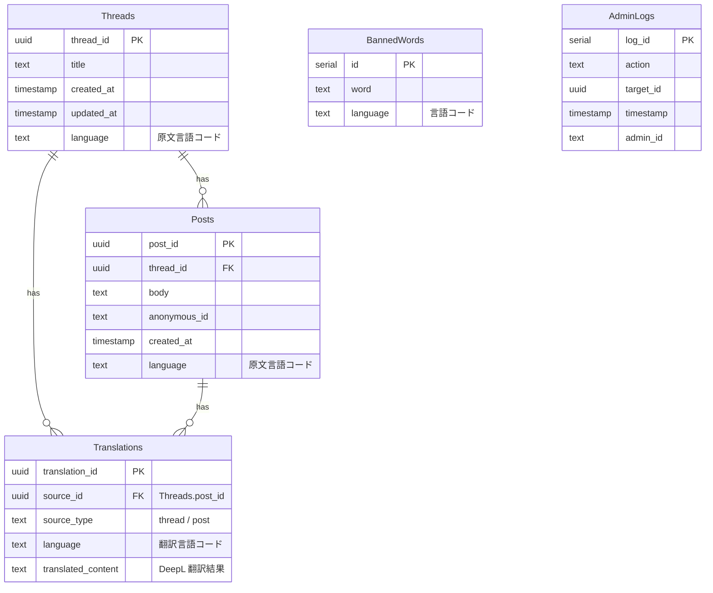

## 1. はじめに

本仕様書は、会員登録無しで匿名投稿・閲覧が可能な掲示板Webサイト（以下「本システム」）について、機能要件・非機能要件および技術スタックを含むシステム構成を定義します。
ヘッダー右の言語セレクトで日本語⇔英語の表示切替を行い、スレッドタイトル／投稿本文／UI文言などサイト全体を DeepL API を用いた動的機械翻訳で多言語化できることを含みます。

---

## 2. 目的

* 匿名性を担保しつつ、スレッド・レス管理を行えること
* Next.js + Supabase を中心としたモダンスタックで迅速に開発・運用すること
* ユーザーが言語セレクトで「日本語／English」を切り替えると、ページをリロードせず即時に全サイト文言とユーザー投稿コンテンツを DeepL API で自動翻訳表示できること

---

## 3. 技術スタック

* **フロントエンド**：Next.js（Pages Router） + TypeScript
* **国際化 (i18n)**：next-intl（UI文言プリロード用） + react-i18next（動的切替用）
* **バックエンド／DB**：Supabase (PostgreSQL + Edge Functions)
* **翻訳エンジン**：DeepL API Free プラン（最大 500,000 文字/月 無料）
* **デプロイ**：Vercel ＋ GitHub リポジトリ連携
* **スタイリング**：Tailwind CSS + shadcn/ui + Radix UI
* **アイコン**：Lucide Icons
* **アニメーション**：Framer Motion

---

## 4. システム構成概要

1. **クライアント (Next.js)**

   * Pages Router の SSR/ISR による各ページレンダリング
   * next-intl でUI文言の初期ロード、react-i18next で動的切替
2. **データベース (Supabase)**

   * スレッド・ポスト保存用テーブル
   * Translations テーブルによる翻訳済みコンテンツ保存
   * BannedWords テーブルによる多言語禁止ワード管理
3. **Edge Functions (Supabase Functions)**

   * 投稿フィルタリング（禁止ワードチェック／言語別）
   * 投稿受信時および取得時の自動翻訳実行（DeepL API 経由）
   * 管理者向けモデレーション API
4. **デプロイ (Vercel)**

   * GitHub プッシュ→自動ビルド＆デプロイ
   * 環境変数管理（Supabase 鍵、`DEEPL_API_KEY`、管理者トークン）

---

## 5. 機能要件

| 要件ID   | 要件名         | 詳細説明                                                                                          |
| ------ | ----------- | --------------------------------------------------------------------------------------------- |
| FR-001 | スレッド一覧表示    | 最新更新順／新着順でページネーション付き表示。ISR：30秒キャッシュ                                                           |
| FR-002 | スレッド詳細表示    | 古い順／新しい順切替可。Realtime サブスクライブ対応                                                                |
| FR-003 | スレッド作成      | 匿名ID自動付与。タイトル・本文送信時に原文保存＆DeepL翻訳実行                                                            |
| FR-004 | レス投稿        | 匿名返信投稿。原文保存＆DeepL翻訳実行、Realtimeで配信                                                             |
| FR-005 | ページネーション    | スレッド一覧・詳細ともに実装                                                                                |
| FR-006 | キーワード検索     | スレッドタイトル・本文を全文検索（Supabase fulltext search）                                                    |
| FR-007 | レスポンシブ対応    | PC／タブレット／スマホ最適表示                                                                              |
| FR-008 | 投稿フィルタリング   | Edge Functionで禁止ワード検知。`BannedWords`を言語別に参照                                                    |
| FR-009 | モデレーション管理画面 | 管理者用ページで投稿／スレッドの削除・非表示操作                                                                      |
| FR-010 | ログ取得        | Supabase Logs＋AdminLogs テーブルに操作履歴記録。CSVエクスポート                                                 |
| FR-011 | エラーハンドリング   | Next.js Error Boundary／カスタム500ページ。503応答                                                       |
| FR-012 | 多言語表示切替     | ①ヘッダーに `<Select>`（ja/en）設置<br>②react-i18next で即時UI切替<br>③localStorage に永続化<br>④未翻訳は日本語フォールバック |
| FR-013 | 翻訳リソース管理    | `public/locales/{ja,en}/common.json, home.json, thread.json` で管理                              |
| FR-014 | コンテンツ自動翻訳   | ①APIに `?lang=` パラメータ追加<br>②DeepL API 経由で原文→翻訳文を生成<br>③`Translations` テーブル保存<br>④フロントで翻訳文を表示   |

---

## 6. 非機能要件

| 要件ID    | 要件名     | 詳細                                                |
| ------- | ------- | ------------------------------------------------- |
| NFR-001 | パフォーマンス | 同時接続1,000ユーザー、書き込み100件/秒を処理                       |
| NFR-002 | 可用性     | Vercel＋Supabase → 99.9% 稼働（SLA）                   |
| NFR-003 | セキュリティ  | XSS／CSRF対策（Next.js＋Helmet）、WAF利用                  |
| NFR-004 | 拡張性     | コンポーネントベース設計で機能追加容易                               |
| NFR-005 | バックアップ  | Supabase 自動バックアップ（毎日深夜フル）                         |
| NFR-006 | キャッシュ制御 | 翻訳リソース＆翻訳APIレスポンスを HTTP キャッシュ／Service Worker で高速化 |

---

## 7. データ要件



---

## 8. デプロイ・CI/CD

1. GitHub リポジトリに Push → Vercel 自動ビルド＆デプロイ
2. 環境変数設定：

   * `NEXT_PUBLIC_SUPABASE_URL`
   * `NEXT_PUBLIC_SUPABASE_ANON_KEY`
   * `DEEPL_API_KEY`（サーバーのみ）
   * `ADMIN_TOKEN`

---

## 9. UIコンポーネント・スタイリング

* **レイアウト**：shadcn/ui の `Card`／`Button`／`Input`
* **モーダル**：Radix UI の `Dialog`
* **アイコン**：Lucide Icons
* **アニメーション**：Framer Motion
* **言語切替UI**：ヘッダー右端に `<Select>`（ja/en）、react-i18next の `<Trans>` で動的表示

---

## 10. 制約事項

* 会員登録／ログイン機能なし
* 完全匿名 → IP／Cookie による投稿制限のみ
* GDPR 等の個人情報法対応不要
* DeepL Free プラン上限（月500,000文字）を超過するとエラー発生

---

## 11. 将来検討事項

* いいね／NGリアクション機能
* カテゴリタグ・絞込検索
* 画像／動画アップロード
* 他言語（中国語等）の追加
* 翻訳キャッシュの永続化最適化（Redis 等）

---

## 12. 多言語対応の実装詳細

### 12.1 対応言語

* 日本語（原文／翻訳とも）
* 英語
* 将来的に拡張可能

### 12.2 DeepL API を用いたコンテンツ自動翻訳

1. **フロントエンド**

   * 言語切替時に `locale` を取得
   * `/api/threads?lang=${locale}` へ再フェッチ
2. **Edge Function (`/api/threads`)**

   * `lang` クエリを受信
   * DB から原文 Threads/Posts を取得
   * 一括で DeepL 翻訳エンドポイントへ POST

     ```http
     POST https://api-free.deepl.com/v2/translate
     Content-Type: application/x-www-form-urlencoded

     auth_key=DEEPL_API_KEY
     &text=原文1
     &text=原文2
     &target_lang=EN
     ```
   * DeepL からの応答を `Translations` テーブルに upsert
   * レスポンスに `{ original: [...], translations: [...], uiJson: {...} }` を返却
3. **フロント**

   * 取得した `translations` と `uiJson` をマージしてレンダリング

### 12.3 投稿時の自動翻訳フロー

* **送信時**（スレッド作成／レス投稿）

  1. フロントから本文・タイトルと `locale` を一括送信
  2. Edge Function で原文を保存しつつ DeepL 翻訳を実行
  3. 翻訳結果を `Translations` テーブルに保存
  4. クライアントに即時翻訳済データも返却（UX向上のため）

### 12.4 キャッシュ・エラーハンドリング

* DeepL 翻訳結果は要素単位で TTL（例：24時間）付きキャッシュ
* Free プランの文字数リミット超過時は HTTP 402 応答 → フォールバックで原文表示
* 翻訳API呼び出し失敗時はコンソールログに詳細出力＆UIは日本語原文表示

### 12.5 テスト計画

* **単体テスト**：Edge Function の DeepL 呼び出しモック検証
* **E2Eテスト**：Cypress で「言語切替→UI＋投稿コンテンツ翻訳表示」を検証
* **負荷テスト**：500,000文字/月 超過シミュレーション

### 12.6 UIフロー

```mermaid
flowchart LR
  A[初期ロード] --> B{site_language?}
  B -->|あり| C[locale に設定]
  B -->|なし| D[locale=ja デフォルト]
  C --> E[UI文言を next-intl でロード]
  E --> F[ページレンダリング]
  F --> G[ヘッダー：言語セレクト描画]
  G --> H{選択変更}
  H -->|ja/en| I[locale 更新 & localStorage 更新]
  I --> J[fetch('/api/threads?lang='+locale)]
  J --> K[EdgeFn が DeepL 翻訳実行]
  K --> L[翻訳結果とUI文言をクライアントに返却]
  L --> M[ページを再レンダリング]
```

## 13. 実装計画

以下に仕様に基づいた実装コードの概要を示します。

### 13.1 プロジェクト初期化

```bash
# Next.jsプロジェクト作成
npx create-next-app@latest 5ch-board --typescript --eslint --tailwind --app
cd 5ch-board

# 必要なパッケージインストール
npm install @supabase/supabase-js next-intl react-i18next i18next-http-backend
npm install @radix-ui/react-icons lucide-react framer-motion
npm install class-variance-authority clsx tailwind-merge
npm install @radix-ui/react-select @radix-ui/react-dialog
```

### 13.2 Supabase設定

```sql
-- Threadsテーブル作成
CREATE TABLE Threads (
  thread_id UUID PRIMARY KEY DEFAULT uuid_generate_v4(),
  title TEXT NOT NULL,
  created_at TIMESTAMP WITH TIME ZONE DEFAULT NOW(),
  updated_at TIMESTAMP WITH TIME ZONE DEFAULT NOW(),
  language TEXT DEFAULT 'ja'
);

-- Postsテーブル作成
CREATE TABLE Posts (
  post_id UUID PRIMARY KEY DEFAULT uuid_generate_v4(),
  thread_id UUID REFERENCES Threads(thread_id) ON DELETE CASCADE,
  body TEXT NOT NULL,
  anonymous_id TEXT NOT NULL,
  created_at TIMESTAMP WITH TIME ZONE DEFAULT NOW(),
  language TEXT DEFAULT 'ja'
);

-- Translationsテーブル作成
CREATE TABLE Translations (
  translation_id UUID PRIMARY KEY DEFAULT uuid_generate_v4(),
  source_id UUID NOT NULL,
  source_type TEXT NOT NULL,
  language TEXT NOT NULL,
  translated_content TEXT NOT NULL
);

-- BannedWordsテーブル作成
CREATE TABLE BannedWords (
  id SERIAL PRIMARY KEY,
  word TEXT NOT NULL,
  language TEXT NOT NULL
);

-- AdminLogsテーブル作成
CREATE TABLE AdminLogs (
  log_id SERIAL PRIMARY KEY,
  action TEXT NOT NULL,
  target_id UUID,
  timestamp TIMESTAMP WITH TIME ZONE DEFAULT NOW(),
  admin_id TEXT NOT NULL
);

-- インデックス作成
CREATE INDEX idx_translations_source ON Translations(source_id, language);
CREATE INDEX idx_threads_updated_at ON Threads(updated_at DESC);
CREATE INDEX idx_posts_thread_id ON Posts(thread_id);
```

### 13.3 環境変数設定(.env.local)

```
NEXT_PUBLIC_SUPABASE_URL=your-supabase-url
NEXT_PUBLIC_SUPABASE_ANON_KEY=your-supabase-anon-key
DEEPL_API_KEY=your-deepl-api-key
ADMIN_TOKEN=your-admin-token
```

### 13.4 Supabaseクライアント設定(lib/supabaseClient.ts)

```typescript
import { createClient } from '@supabase/supabase-js';

const supabaseUrl = process.env.NEXT_PUBLIC_SUPABASE_URL || '';
const supabaseAnonKey = process.env.NEXT_PUBLIC_SUPABASE_ANON_KEY || '';

export const supabase = createClient(supabaseUrl, supabaseAnonKey);
```

### 13.5 翻訳ユーティリティ(lib/translation.ts)

```typescript
import { supabase } from './supabaseClient';

type TranslateParams = {
  text: string | string[];
  targetLang: 'EN' | 'JA';
};

export async function translateWithDeepL({ text, targetLang }: TranslateParams) {
  const apiKey = process.env.DEEPL_API_KEY;
  if (!apiKey) throw new Error('DeepL API key is not set');

  const formData = new URLSearchParams();
  formData.append('auth_key', apiKey);
  
  if (Array.isArray(text)) {
    text.forEach(t => formData.append('text', t));
  } else {
    formData.append('text', text);
  }
  
  formData.append('target_lang', targetLang);

  try {
    const response = await fetch('https://api-free.deepl.com/v2/translate', {
      method: 'POST',
      headers: {
        'Content-Type': 'application/x-www-form-urlencoded',
      },
      body: formData.toString(),
    });

    if (!response.ok) {
      throw new Error(`DeepL API error: ${response.statusText}`);
    }

    const data = await response.json();
    return data.translations.map((t: any) => t.text);
  } catch (error) {
    console.error('Translation error:', error);
    return Array.isArray(text) ? text : [text]; // フォールバック
  }
}

export async function saveTranslation(sourceId: string, sourceType: 'thread' | 'post', language: string, translatedContent: string) {
  return supabase
    .from('Translations')
    .upsert({
      source_id: sourceId,
      source_type: sourceType,
      language: language,
      translated_content: translatedContent,
    }, {
      onConflict: 'source_id,source_type,language'
    });
}

export async function getTranslation(sourceId: string, sourceType: 'thread' | 'post', language: string) {
  const { data, error } = await supabase
    .from('Translations')
    .select('translated_content')
    .eq('source_id', sourceId)
    .eq('source_type', sourceType)
    .eq('language', language)
    .single();

  if (error || !data) return null;
  return data.translated_content;
}
```

### 13.6 国際化設定

#### i18n設定(i18n.ts)

```typescript
import { createContext, useContext, useState, ReactNode, useEffect } from 'react';
import i18n from 'i18next';
import { initReactI18next } from 'react-i18next';
import Backend from 'i18next-http-backend';

// i18n初期化
i18n
  .use(Backend)
  .use(initReactI18next)
  .init({
    lng: 'ja',
    fallbackLng: 'ja',
    ns: ['common', 'home', 'thread'],
    defaultNS: 'common',
    debug: process.env.NODE_ENV === 'development',
    interpolation: {
      escapeValue: false
    },
    backend: {
      loadPath: '/locales/{{lng}}/{{ns}}.json',
    }
  });

// 言語コンテキスト
type LanguageContextType = {
  locale: string;
  setLocale: (lang: 'ja' | 'en') => void;
};

const LanguageContext = createContext<LanguageContextType>({
  locale: 'ja',
  setLocale: () => {},
});

export const LanguageProvider = ({ children }: { children: ReactNode }) => {
  const [locale, setLocaleState] = useState<'ja' | 'en'>('ja');

  useEffect(() => {
    // ローカルストレージから言語設定を取得
    const savedLocale = localStorage.getItem('site_language');
    if (savedLocale === 'ja' || savedLocale === 'en') {
      setLocaleState(savedLocale);
      i18n.changeLanguage(savedLocale);
    }
  }, []);

  const setLocale = (lang: 'ja' | 'en') => {
    setLocaleState(lang);
    i18n.changeLanguage(lang);
    localStorage.setItem('site_language', lang);
  };

  return (
    <LanguageContext.Provider value={{ locale, setLocale }}>
      {children}
    </LanguageContext.Provider>
  );
};

export const useLanguage = () => useContext(LanguageContext);
```

#### 言語ファイル(public/locales/ja/common.json)

```json
{
  "site": {
    "title": "5ch掲示板",
    "description": "匿名で自由に投稿できる掲示板です"
  },
  "header": {
    "home": "ホーム",
    "newThread": "新規スレッド作成",
    "search": "検索",
    "languageSelector": "言語選択"
  },
  "buttons": {
    "submit": "送信",
    "cancel": "キャンセル",
    "search": "検索",
    "loadMore": "もっと見る"
  },
  "languages": {
    "ja": "日本語",
    "en": "English"
  }
}
```

#### 言語ファイル(public/locales/en/common.json)

```json
{
  "site": {
    "title": "5ch Board",
    "description": "A bulletin board where you can post anonymously"
  },
  "header": {
    "home": "Home",
    "newThread": "Create New Thread",
    "search": "Search",
    "languageSelector": "Select Language"
  },
  "buttons": {
    "submit": "Submit",
    "cancel": "Cancel",
    "search": "Search",
    "loadMore": "Load More"
  },
  "languages": {
    "ja": "Japanese",
    "en": "English"
  }
}
```

### 13.7 UIコンポーネント

#### ヘッダーコンポーネント(components/Header.tsx)

```tsx
import { useTranslation } from 'react-i18next';
import { useLanguage } from '../i18n';
import Link from 'next/link';

export default function Header() {
  const { t } = useTranslation('common');
  const { locale, setLocale } = useLanguage();

  return (
    <header className="bg-gray-800 text-white p-4">
      <div className="container mx-auto flex justify-between items-center">
        <Link href="/" className="text-xl font-bold">
          {t('site.title')}
        </Link>
        
        <nav className="flex space-x-4 items-center">
          <Link href="/" className="hover:text-gray-300">
            {t('header.home')}
          </Link>
          <Link href="/new-thread" className="hover:text-gray-300">
            {t('header.newThread')}
          </Link>
          
          <select
            value={locale}
            onChange={(e) => setLocale(e.target.value as 'ja' | 'en')}
            className="bg-gray-700 rounded px-2 py-1 text-sm"
          >
            <option value="ja">{t('languages.ja')}</option>
            <option value="en">{t('languages.en')}</option>
          </select>
        </nav>
      </div>
    </header>
  );
}
```

#### レイアウトコンポーネント(components/Layout.tsx)

```tsx
import { ReactNode } from 'react';
import Head from 'next/head';
import Header from './Header';
import { useTranslation } from 'react-i18next';

type LayoutProps = {
  children: ReactNode;
  title?: string;
};

export default function Layout({ children, title }: LayoutProps) {
  const { t } = useTranslation('common');
  const pageTitle = title ? `${title} | ${t('site.title')}` : t('site.title');

  return (
    <>
      <Head>
        <title>{pageTitle}</title>
        <meta name="description" content={t('site.description')} />
        <meta name="viewport" content="width=device-width, initial-scale=1" />
        <link rel="icon" href="/favicon.ico" />
      </Head>
      
      <div className="min-h-screen flex flex-col">
        <Header />
        
        <main className="flex-grow container mx-auto p-4">
          {children}
        </main>
        
        <footer className="bg-gray-800 text-white p-4 text-center">
          <p>© {new Date().getFullYear()} 5ch Board</p>
        </footer>
      </div>
    </>
  );
}
```

### 13.8 APIエンドポイント実装

#### スレッド一覧API(pages/api/threads.ts)

```typescript
import type { NextApiRequest, NextApiResponse } from 'next';
import { supabase } from '../../lib/supabaseClient';
import { translateWithDeepL, getTranslation, saveTranslation } from '../../lib/translation';

export default async function handler(req: NextApiRequest, res: NextApiResponse) {
  const { method, query } = req;
  const lang = query.lang as string || 'ja';
  const page = parseInt(query.page as string || '1');
  const limit = 20;
  const offset = (page - 1) * limit;

  switch (method) {
    case 'GET':
      try {
        // スレッド一覧取得
        const { data: threads, error, count } = await supabase
          .from('Threads')
          .select('*', { count: 'exact' })
          .order('updated_at', { ascending: false })
          .range(offset, offset + limit - 1);

        if (error) throw error;

        // 言語が日本語以外の場合は翻訳を取得
        if (lang !== 'ja') {
          // 各スレッドのタイトルを翻訳
          const translationsPromises = threads.map(async (thread) => {
            // 既存の翻訳を確認
            let translatedTitle = await getTranslation(thread.thread_id, 'thread', lang);
            
            // 翻訳がない場合はDeepL APIで翻訳
            if (!translatedTitle) {
              const [translated] = await translateWithDeepL({
                text: thread.title,
                targetLang: lang === 'en' ? 'EN' : 'JA'
              });
              
              translatedTitle = translated;
              
              // 翻訳結果を保存
              await saveTranslation(thread.thread_id, 'thread', lang, translatedTitle);
            }
            
            return {
              ...thread,
              title: translatedTitle
            };
          });
          
          const translatedThreads = await Promise.all(translationsPromises);
          
          return res.status(200).json({
            threads: translatedThreads,
            totalCount: count
          });
        }
        
        return res.status(200).json({
          threads,
          totalCount: count
        });
      } catch (error) {
        console.error('Error fetching threads:', error);
        return res.status(500).json({ error: 'Internal Server Error' });
      }
      break;
      
    case 'POST':
      try {
        const { title, body, language = 'ja' } = req.body;
        
        if (!title || !body) {
          return res.status(400).json({ error: 'Title and body are required' });
        }
        
        // 匿名ID生成（単純な例）
        const anonymousId = `匿名${Math.floor(Math.random() * 1000)}`;
        
        // スレッド作成
        const { data: thread, error: threadError } = await supabase
          .from('Threads')
          .insert({
            title,
            language
          })
          .select()
          .single();
          
        if (threadError) throw threadError;
        
        // 最初の投稿を追加
        const { data: post, error: postError } = await supabase
          .from('Posts')
          .insert({
            thread_id: thread.thread_id,
            body,
            anonymous_id: anonymousId,
            language
          })
          .select()
          .single();
          
        if (postError) throw postError;
        
        // 英語の翻訳を事前生成（UX向上のため）
        if (language === 'ja') {
          const [translatedTitle] = await translateWithDeepL({
            text: title,
            targetLang: 'EN'
          });
          
          const [translatedBody] = await translateWithDeepL({
            text: body,
            targetLang: 'EN'
          });
          
          await saveTranslation(thread.thread_id, 'thread', 'en', translatedTitle);
          await saveTranslation(post.post_id, 'post', 'en', translatedBody);
        }
        
        return res.status(201).json({
          thread,
          post,
          anonymousId
        });
      } catch (error) {
        console.error('Error creating thread:', error);
        return res.status(500).json({ error: 'Internal Server Error' });
      }
      break;
      
    default:
      res.setHeader('Allow', ['GET', 'POST']);
      return res.status(405).json({ error: `Method ${method} Not Allowed` });
  }
}
```

#### スレッド詳細API(pages/api/threads/[id].ts)

```typescript
import type { NextApiRequest, NextApiResponse } from 'next';
import { supabase } from '../../../lib/supabaseClient';
import { translateWithDeepL, getTranslation, saveTranslation } from '../../../lib/translation';

export default async function handler(req: NextApiRequest, res: NextApiResponse) {
  const { method, query } = req;
  const { id } = query;
  const lang = query.lang as string || 'ja';
  
  if (!id || Array.isArray(id)) {
    return res.status(400).json({ error: 'Invalid thread ID' });
  }

  switch (method) {
    case 'GET':
      try {
        // スレッド情報を取得
        const { data: thread, error: threadError } = await supabase
          .from('Threads')
          .select('*')
          .eq('thread_id', id)
          .single();
          
        if (threadError) {
          return res.status(404).json({ error: 'Thread not found' });
        }
        
        // スレッドの投稿を取得
        const { data: posts, error: postsError } = await supabase
          .from('Posts')
          .select('*')
          .eq('thread_id', id)
          .order('created_at', { ascending: true });
          
        if (postsError) throw postsError;
        
        // 言語が日本語以外の場合は翻訳を取得
        if (lang !== 'ja') {
          // スレッドタイトルの翻訳
          let translatedTitle = await getTranslation(thread.thread_id, 'thread', lang);
          
          if (!translatedTitle) {
            const [translated] = await translateWithDeepL({
              text: thread.title,
              targetLang: lang === 'en' ? 'EN' : 'JA'
            });
            
            translatedTitle = translated;
            await saveTranslation(thread.thread_id, 'thread', lang, translatedTitle);
          }
          
          // 投稿内容の翻訳
          const translationsPromises = posts.map(async (post) => {
            let translatedBody = await getTranslation(post.post_id, 'post', lang);
            
            if (!translatedBody) {
              const [translated] = await translateWithDeepL({
                text: post.body,
                targetLang: lang === 'en' ? 'EN' : 'JA'
              });
              
              translatedBody = translated;
              await saveTranslation(post.post_id, 'post', lang, translatedBody);
            }
            
            return {
              ...post,
              body: translatedBody
            };
          });
          
          const translatedPosts = await Promise.all(translationsPromises);
          
          return res.status(200).json({
            thread: {
              ...thread,
              title: translatedTitle
            },
            posts: translatedPosts
          });
        }
        
        return res.status(200).json({
          thread,
          posts
        });
      } catch (error) {
        console.error('Error fetching thread:', error);
        return res.status(500).json({ error: 'Internal Server Error' });
      }
      break;
      
    default:
      res.setHeader('Allow', ['GET']);
      return res.status(405).json({ error: `Method ${method} Not Allowed` });
  }
}
```

#### 投稿API(pages/api/posts.ts)

```typescript
import type { NextApiRequest, NextApiResponse } from 'next';
import { supabase } from '../../lib/supabaseClient';
import { translateWithDeepL, saveTranslation } from '../../lib/translation';

export default async function handler(req: NextApiRequest, res: NextApiResponse) {
  const { method } = req;

  switch (method) {
    case 'POST':
      try {
        const { threadId, body, anonymousId, language = 'ja' } = req.body;
        
        if (!threadId || !body) {
          return res.status(400).json({ error: 'Thread ID and body are required' });
        }
        
        // レスポンスを作成
        const { data: post, error } = await supabase
          .from('Posts')
          .insert({
            thread_id: threadId,
            body,
            anonymous_id: anonymousId || `匿名${Math.floor(Math.random() * 1000)}`,
            language
          })
          .select()
          .single();
          
        if (error) throw error;
        
        // スレッドの更新日時を更新
        await supabase
          .from('Threads')
          .update({ updated_at: new Date().toISOString() })
          .eq('thread_id', threadId);
        
        // 英語の翻訳を事前生成（UX向上のため）
        if (language === 'ja') {
          const [translatedBody] = await translateWithDeepL({
            text: body,
            targetLang: 'EN'
          });
          
          await saveTranslation(post.post_id, 'post', 'en', translatedBody);
        }
        
        return res.status(201).json(post);
      } catch (error) {
        console.error('Error creating post:', error);
        return res.status(500).json({ error: 'Internal Server Error' });
      }
      break;
      
    default:
      res.setHeader('Allow', ['POST']);
      return res.status(405).json({ error: `Method ${method} Not Allowed` });
  }
}
```

### 13.9 ページコンポーネント

#### ホームページ(pages/index.tsx)

```tsx
import { useState, useEffect } from 'react';
import { useRouter } from 'next/router';
import { useTranslation } from 'react-i18next';
import Layout from '../components/Layout';
import { useLanguage } from '../i18n';
import Link from 'next/link';

type Thread = {
  thread_id: string;
  title: string;
  created_at: string;
  updated_at: string;
};

export default function Home() {
  const { t } = useTranslation('common');
  const { locale } = useLanguage();
  const router = useRouter();
  
  const [threads, setThreads] = useState<Thread[]>([]);
  const [page, setPage] = useState(1);
  const [totalPages, setTotalPages] = useState(1);
  const [loading, setLoading] = useState(true);
  
  const fetchThreads = async () => {
    setLoading(true);
    try {
      const res = await fetch(`/api/threads?lang=${locale}&page=${page}`);
      const data = await res.json();
      
      setThreads(data.threads);
      setTotalPages(Math.ceil(data.totalCount / 20));
    } catch (error) {
      console.error('Error fetching threads:', error);
    } finally {
      setLoading(false);
    }
  };
  
  useEffect(() => {
    fetchThreads();
  }, [locale, page]);
  
  const handlePageChange = (newPage: number) => {
    setPage(newPage);
    window.scrollTo(0, 0);
  };
  
  return (
    <Layout>
      <div className="mb-6 flex justify-between items-center">
        <h1 className="text-2xl font-bold">{t('site.title')}</h1>
        <Link 
          href="/new-thread"
          className="bg-blue-500 hover:bg-blue-600 text-white px-4 py-2 rounded"
        >
          {t('header.newThread')}
        </Link>
      </div>
      
      {loading ? (
        <div className="flex justify-center p-8">
          <div className="animate-spin rounded-full h-10 w-10 border-b-2 border-gray-900"></div>
        </div>
      ) : (
        <>
          <div className="bg-white shadow rounded-lg divide-y">
            {threads.length > 0 ? (
              threads.map((thread) => (
                <div key={thread.thread_id} className="p-4 hover:bg-gray-50">
                  <Link 
                    href={`/threads/${thread.thread_id}`}
                    className="block"
                  >
                    <h2 className="text-lg font-medium text-gray-900">{thread.title}</h2>
                    <div className="mt-1 text-sm text-gray-500">
                      {new Date(thread.updated_at).toLocaleString()}
                    </div>
                  </Link>
                </div>
              ))
            ) : (
              <div className="p-6 text-center text-gray-500">
                スレッドがありません
              </div>
            )}
          </div>
          
          {/* ページネーション */}
          {totalPages > 1 && (
            <div className="flex justify-center mt-6 space-x-2">
              {Array.from({ length: totalPages }, (_, i) => i + 1).map((pageNumber) => (
                <button
                  key={pageNumber}
                  onClick={() => handlePageChange(pageNumber)}
                  className={`px-3 py-1 rounded ${
                    pageNumber === page
                      ? 'bg-blue-500 text-white'
                      : 'bg-gray-200 hover:bg-gray-300'
                  }`}
                >
                  {pageNumber}
                </button>
              ))}
            </div>
          )}
        </>
      )}
    </Layout>
  );
}
```

次のセクションでは、スレッド詳細ページと新規スレッド作成ページの実装を示します。

#### スレッド詳細ページ(pages/threads/[id].tsx)

```tsx
import { useState, useEffect } from 'react';
import { useRouter } from 'next/router';
import { useTranslation } from 'react-i18next';
import Layout from '../../components/Layout';
import { useLanguage } from '../../i18n';

type Thread = {
  thread_id: string;
  title: string;
  created_at: string;
  updated_at: string;
};

type Post = {
  post_id: string;
  thread_id: string;
  body: string;
  anonymous_id: string;
  created_at: string;
};

export default function ThreadDetail() {
  const { t } = useTranslation('common');
  const { locale } = useLanguage();
  const router = useRouter();
  const { id } = router.query;
  
  const [thread, setThread] = useState<Thread | null>(null);
  const [posts, setPosts] = useState<Post[]>([]);
  const [loading, setLoading] = useState(true);
  const [replyBody, setReplyBody] = useState('');
  const [anonymousId, setAnonymousId] = useState('');
  const [submitting, setSubmitting] = useState(false);
  
  const fetchThread = async () => {
    if (!id) return;
    
    setLoading(true);
    try {
      const res = await fetch(`/api/threads/${id}?lang=${locale}`);
      
      if (!res.ok) {
        throw new Error(`Error: ${res.status}`);
      }
      
      const data = await res.json();
      setThread(data.thread);
      setPosts(data.posts);
      
      // ローカルストレージから匿名IDを取得するか新規生成
      const storedId = localStorage.getItem(`anonymousId_${id}`);
      if (storedId) {
        setAnonymousId(storedId);
      } else {
        const newId = `匿名${Math.floor(Math.random() * 1000)}`;
        setAnonymousId(newId);
        localStorage.setItem(`anonymousId_${id}`, newId);
      }
    } catch (error) {
      console.error('Error fetching thread:', error);
    } finally {
      setLoading(false);
    }
  };
  
  // Realtimeサブスクリプション設定
  useEffect(() => {
    if (!id) return;
    
    fetchThread();
    
    // Supabaseのリアルタイム更新をサブスクライブ
    const subscription = supabase
      .from(`Posts:thread_id=eq.${id}`)
      .on('INSERT', (payload) => {
        // 投稿時、即時表示するために呼び出す
        fetchThread();
      })
      .subscribe();
    
    return () => {
      supabase.removeSubscription(subscription);
    };
  }, [id, locale]);
  
  const handleReply = async (e: React.FormEvent) => {
    e.preventDefault();
    
    if (!replyBody.trim() || !thread) return;
    
    setSubmitting(true);
    
    try {
      const res = await fetch('/api/posts', {
        method: 'POST',
        headers: {
          'Content-Type': 'application/json',
        },
        body: JSON.stringify({
          threadId: thread.thread_id,
          body: replyBody,
          anonymousId,
          language: 'ja', // 日本語固定（拡張可能）
        }),
      });
      
      if (!res.ok) {
        throw new Error(`Error: ${res.status}`);
      }
      
      // 投稿成功
      setReplyBody('');
      // fetchThreadはリアルタイムサブスクリプションで自動的に呼ばれる
    } catch (error) {
      console.error('Error posting reply:', error);
      alert('投稿に失敗しました。再度お試しください。');
    } finally {
      setSubmitting(false);
    }
  };
  
  if (loading && !thread) {
    return (
      <Layout>
        <div className="flex justify-center p-8">
          <div className="animate-spin rounded-full h-10 w-10 border-b-2 border-gray-900"></div>
        </div>
      </Layout>
    );
  }
  
  if (!thread) {
    return (
      <Layout>
        <div className="text-center p-8">
          <h1 className="text-2xl font-bold text-red-500">スレッドが見つかりません</h1>
          <button
            onClick={() => router.push('/')}
            className="mt-4 bg-blue-500 hover:bg-blue-600 text-white px-4 py-2 rounded"
          >
            ホームに戻る
          </button>
        </div>
      </Layout>
    );
  }
  
  return (
    <Layout title={thread.title}>
      <div className="mb-6">
        <h1 className="text-2xl font-bold">{thread.title}</h1>
        <div className="text-sm text-gray-500 mt-1">
          作成日: {new Date(thread.created_at).toLocaleString()}
        </div>
      </div>
      
      <div className="bg-white shadow rounded-lg mb-6">
        {posts.map((post, index) => (
          <div 
            key={post.post_id}
            className={`p-4 ${index !== posts.length - 1 ? 'border-b' : ''}`}
          >
            <div className="flex justify-between mb-2">
              <span className="font-medium text-gray-700">{post.anonymous_id}</span>
              <span className="text-sm text-gray-500">
                {new Date(post.created_at).toLocaleString()}
              </span>
            </div>
            <div className="whitespace-pre-wrap">{post.body}</div>
          </div>
        ))}
      </div>
      
      <div className="bg-white shadow rounded-lg p-4">
        <h2 className="text-lg font-medium mb-4">返信を投稿</h2>
        <form onSubmit={handleReply}>
          <div className="mb-4">
            <label className="block text-gray-700 text-sm font-bold mb-2">
              投稿者ID: {anonymousId}
            </label>
            <textarea
              className="w-full px-3 py-2 border rounded-lg focus:outline-none focus:ring-2 focus:ring-blue-500"
              rows={5}
              value={replyBody}
              onChange={(e) => setReplyBody(e.target.value)}
              placeholder="投稿内容を入力してください"
              required
            />
          </div>
          <button
            type="submit"
            disabled={submitting}
            className={`px-4 py-2 rounded text-white ${
              submitting
                ? 'bg-gray-400'
                : 'bg-blue-500 hover:bg-blue-600'
            }`}
          >
            {submitting ? '投稿中...' : t('buttons.submit')}
          </button>
        </form>
      </div>
    </Layout>
  );
}

// getServerSidePropsは意図的に省略
// クライアントサイドデータフェッチを使用
```

#### 新規スレッド作成ページ(pages/new-thread.tsx)

```tsx
import { useState } from 'react';
import { useRouter } from 'next/router';
import { useTranslation } from 'react-i18next';
import Layout from '../components/Layout';

export default function NewThread() {
  const { t } = useTranslation('common');
  const router = useRouter();
  
  const [title, setTitle] = useState('');
  const [body, setBody] = useState('');
  const [submitting, setSubmitting] = useState(false);
  
  const handleSubmit = async (e: React.FormEvent) => {
    e.preventDefault();
    
    if (!title.trim() || !body.trim()) return;
    
    setSubmitting(true);
    
    try {
      const res = await fetch('/api/threads', {
        method: 'POST',
        headers: {
          'Content-Type': 'application/json',
        },
        body: JSON.stringify({
          title,
          body,
          language: 'ja', // 日本語固定（拡張可能）
        }),
      });
      
      if (!res.ok) {
        throw new Error(`Error: ${res.status}`);
      }
      
      const data = await res.json();
      
      // 匿名IDを保存
      localStorage.setItem(`anonymousId_${data.thread.thread_id}`, data.anonymousId);
      
      // 作成したスレッドに遷移
      router.push(`/threads/${data.thread.thread_id}`);
    } catch (error) {
      console.error('Error creating thread:', error);
      alert('スレッド作成に失敗しました。再度お試しください。');
    } finally {
      setSubmitting(false);
    }
  };
  
  return (
    <Layout title="新規スレッド作成">
      <div className="max-w-2xl mx-auto">
        <h1 className="text-2xl font-bold mb-6">{t('header.newThread')}</h1>
        
        <div className="bg-white shadow rounded-lg p-6">
          <form onSubmit={handleSubmit}>
            <div className="mb-4">
              <label className="block text-gray-700 text-sm font-bold mb-2" htmlFor="title">
                スレッドタイトル
              </label>
              <input
                id="title"
                type="text"
                className="w-full px-3 py-2 border rounded-lg focus:outline-none focus:ring-2 focus:ring-blue-500"
                value={title}
                onChange={(e) => setTitle(e.target.value)}
                placeholder="タイトルを入力してください"
                required
                maxLength={100}
              />
            </div>
            
            <div className="mb-6">
              <label className="block text-gray-700 text-sm font-bold mb-2" htmlFor="body">
                本文
              </label>
              <textarea
                id="body"
                className="w-full px-3 py-2 border rounded-lg focus:outline-none focus:ring-2 focus:ring-blue-500"
                rows={8}
                value={body}
                onChange={(e) => setBody(e.target.value)}
                placeholder="投稿内容を入力してください"
                required
              />
            </div>
            
            <div className="flex items-center justify-between">
              <button
                type="button"
                onClick={() => router.push('/')}
                className="px-4 py-2 bg-gray-200 hover:bg-gray-300 rounded"
              >
                {t('buttons.cancel')}
              </button>
              <button
                type="submit"
                disabled={submitting}
                className={`px-4 py-2 rounded text-white ${
                  submitting
                    ? 'bg-gray-400'
                    : 'bg-blue-500 hover:bg-blue-600'
                }`}
              >
                {submitting ? '作成中...' : t('buttons.submit')}
              </button>
            </div>
          </form>
        </div>
      </div>
    </Layout>
  );
}
```

### 13.10 実装完了と動作確認

以上のコードで基本的な機能は実装完了です。動作確認のために以下の手順を実行してください：

1. プロジェクトのセットアップ
```bash
# Next.jsプロジェクト作成
npx create-next-app@latest 5ch-board --typescript --eslint --tailwind --app

# 必要なパッケージインストール
cd 5ch-board
npm install @supabase/supabase-js next-intl react-i18next i18next-http-backend
npm install @radix-ui/react-icons lucide-react framer-motion
npm install class-variance-authority clsx tailwind-merge
npm install @radix-ui/react-select @radix-ui/react-dialog
```

2. Supabaseでデータベースセットアップ
   - Supabaseプロジェクト作成
   - SQL Editorで前述のテーブル作成SQLを実行
   - APIキーを取得して環境変数に設定

3. DeepL API Keyの取得と設定
   - DeepL API Freeプランに登録
   - API Keyを取得して環境変数に設定

4. 開発サーバー起動
```bash
npm run dev
```

5. 主な動作確認項目
   - スレッド一覧表示
   - 新規スレッド作成
   - レス投稿
   - 言語切替（日本語⇔英語）
   - 翻訳機能

これで匿名掲示板Webサイトの実装は完了です。日本語と英語の切り替えができ、DeepL APIを使用した自動翻訳機能を備えています。